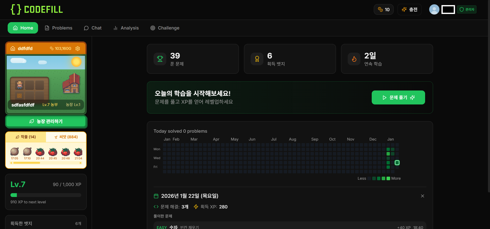
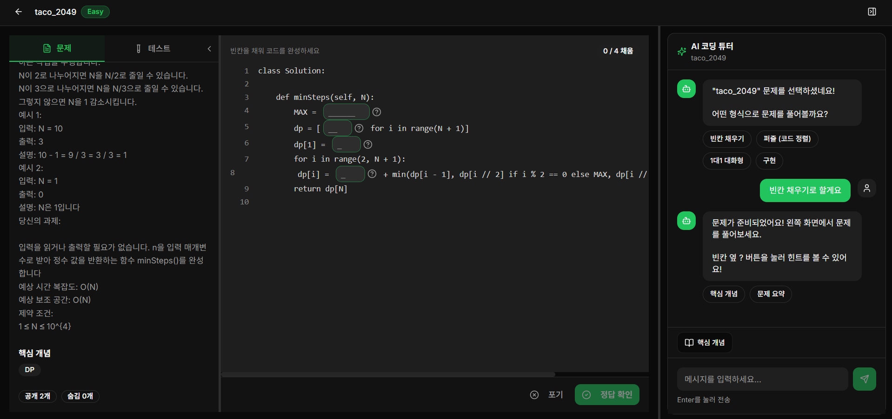
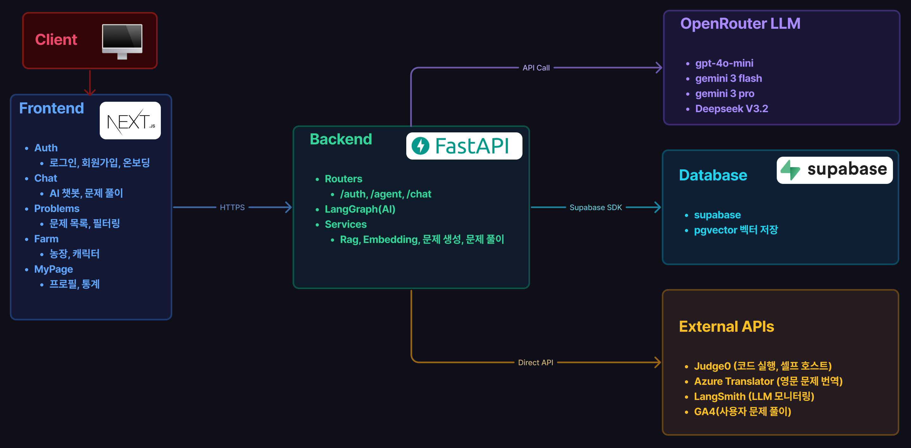

# CodeFill

**AI 기반 인터랙티브 코딩 학습 플랫폼**

[](https://github.com/joyuno/codefill/actions/workflows/deploy.yml)

> CodeFill은 AI 튜터와 함께 알고리즘 문제를 풀며 코딩 실력을 키울 수 있는 학습 플랫폼입니다.
> 단순 문제 풀이가 아닌, AI와의 대화를 통해 개념을 이해하고 점진적으로 실력을 향상시킬 수 있습니다.

**Live Demo**: [https://codefill.co.kr](https://codefill.co.kr)

---

## Screenshots

| 메인 페이지 | 문제 풀이 & AI 채팅 |
|:---:|:---:|
|  |  |

---

## Architecture



- **Frontend** (Next.js 14) → HTTPS → **Backend** (FastAPI)
- **Backend** → Supabase SDK → **Database** (Supabase + pgvector)
- **Backend** → API Call → **OpenRouter LLM** (gpt-4o-mini, Gemini 3 Flash/Pro, DeepSeek V3.2)
- **Backend** → Direct API → **External APIs** (Judge0 코드 실행, Azure Translator 번역, LangSmith 모니터링, GA4 분석)

---

## Features

### 4가지 문제 유형

| 유형 | 설명 |
|------|------|
| **빈칸 채우기 (Blank)** | 주어진 코드에서 핵심 로직 부분이 비어 있고, 직접 코드를 작성하여 완성. Judge0를 통해 실시간 코드 실행 및 채점 |
| **퍼즐 (Puzzle)** | 섞인 코드 블록을 드래그 앤 드롭으로 올바른 순서로 배치. 코드의 논리적 흐름을 이해하는 훈련 |
| **1대1 대화형 튜터 (Guided)** | AI 튜터가 소크라틱 대화 방식으로 단계별 질문을 던지며 학습자가 스스로 답에 도달하도록 유도 |
| **구현 (Implementation)** | 문제 설명과 테스트케이스가 주어지고, 전체 코드를 직접 작성하여 제출. 실행 결과로 채점 |

### AI 챗봇 (40+ 인텐트 분류)

자연어로 대화하면 AI가 의도를 분류하여 적절한 응답을 생성합니다.

- **문제 추천**: 알고리즘 유형, 난이도, 출처(백준/프로그래머스) 기반 맞춤 추천
- **문제 생성**: 원하는 주제와 난이도로 새로운 문제 자동 생성 (빈칸/퍼즐/가이드 모두 지원)
- **힌트 제공**: 풀이 중 막힐 때 단계별 힌트 (접근법 → 알고리즘 → 의사코드 → 부분 코드)
- **코드 분석**: 제출한 코드의 시간/공간 복잡도, 개선점, 엣지 케이스 분석
- **개념 설명**: 알고리즘/자료구조 개념을 예시와 함께 설명
- **일반 대화**: 학습 관련 질문, 동기부여, 학습 전략 조언

### RAG 기반 문제 검색

- **Hybrid Search**: pgvector 벡터 유사도 검색 + 키워드 검색 결합
- **OpenAI Embedding** (text-embedding-3-small)으로 문제 임베딩 생성
- 백준, 프로그래머스 문제 DB에서 조건에 맞는 문제 탐색

### LangGraph 워크플로우

6개의 LangGraph 그래프가 AI 로직을 오케스트레이션합니다.

| 그래프 | 역할 |
|--------|------|
| **Orchestrator** | 사용자 메시지를 받아 인텐트 분류 후 적절한 하위 그래프로 라우팅 |
| **Solving** | 문제 풀이 중 힌트 제공, 코드 분석, 정답 확인 등 풀이 지원 |
| **Discovery** | 문제 탐색/추천 - RAG 검색, 필터링, 난이도 조정 |
| **Collection** | 정보 수집 - 알고리즘 개념 설명, 학습 자료 제공 |
| **Guided Tutor** | 1대1 대화형 문제에서 소크라틱 교수법으로 단계별 안내 |
| **Blank/Puzzle Gen** | 빈칸 채우기 및 퍼즐 문제 자동 생성 |

### 농장 시스템 (Farm)

- 문제를 풀면 XP를 획득하고, XP로 레벨업
- 레벨업 시 **캐릭터**(작물)가 성장하며 시각적으로 변화
- 6단계 성장: 씨앗 → 새싹 → 성장 → 결실 → 수확 → 완성
- 캐릭터 컬렉션 수집 요소

### 티어 & 랭킹

| 티어 | 범위 |
|------|------|
| 실버 | 기본 개념 연습 |
| 골드 | 응용 문제 |
| 플래티넘 | 도전적인 난이도 |
| 다이아 | 고난이도 문제 |
| 마스터 | 최고 난이도 |

- 전체 사용자 랭킹 보드 (XP, 문제 풀이 수 기준)
- 주간/월간 랭킹
- 연속 학습 스트릭 추적

### 뱃지 & 미션

- **뱃지**: 특정 조건 달성 시 자동 부여 (첫 문제 풀이, 연속 7일 학습, 특정 알고리즘 마스터 등)
- **일일/주간 미션**: 매일 갱신되는 학습 목표
- **도전 과제**: 장기 목표 달성 시스템

### 소셜 기능

- **친구 시스템**: 친구 추가/삭제, 친구 목록 관리
- **소셜 로그인**: 카카오, 구글, 깃허브 OAuth
- **온보딩**: 가입 시 선호 언어, 관심 알고리즘, 난이도 등 맞춤 설정

### 학습 분석 (Analysis)

- **풀이 통계**: 일별/주별/월별 문제 풀이 수, 정답률
- **알고리즘별 분석**: 유형별 강점/약점 시각화
- **학습 히트맵**: GitHub 스타일 잔디 히트맵
- **AI 학습 리포트**: 주간 학습 패턴 분석 및 개선 제안

### 관리자 (Admin)

- 사용자 관리 (목록, 검색, 상태 변경)
- 문제 관리 (CRUD, 태그 관리)
- 뱃지/미션 관리
- 시스템 통계 대시보드

---

## Tech Stack

### Frontend
| 기술 | 용도 |
|------|------|
| Next.js 14 (App Router) | 프레임워크 |
| TypeScript | 타입 안전성 |
| Tailwind CSS + shadcn/ui | 스타일링 & UI 컴포넌트 |
| Framer Motion | 애니메이션 |
| Zustand + React Context | 상태 관리 |
| Monaco Editor | 코드 에디터 |
| Recharts | 차트/통계 시각화 |

### Backend
| 기술 | 용도 |
|------|------|
| FastAPI (Python) | API 서버 |
| LangGraph + LangChain | AI 워크플로우 오케스트레이션 |
| Supabase (PostgreSQL) | 데이터베이스 (67개 테이블) |
| pgvector | 벡터 검색 (RAG) |
| Judge0 (셀프 호스팅) | 코드 실행 및 채점 |
| Azure Translator | 영문 문제 한글 번역 |

### AI/LLM
| 모델 | 용도 |
|------|------|
| GPT-4o-mini (OpenRouter) | 챗봇, 인텐트 분류 |
| Gemini 2.0 Flash (3키 로테이션) | 문제 생성, 힌트, 코드 분석 |
| text-embedding-3-small (OpenAI) | 문제 임베딩 생성 |

### Infrastructure
| 기술 | 용도 |
|------|------|
| AWS EC2 + ECR | 서버 호스팅 & 컨테이너 레지스트리 |
| Docker | 컨테이너화 |
| GitHub Actions | CI/CD 자동 배포 |
| LangSmith | LLM 호출 모니터링 |
| Google Analytics + Clarity | 사용자 행동 분석 |

---

## Project Structure

```
codefill/
├── src/                          # Next.js Frontend
│   ├── app/                      # App Router
│   │   ├── (auth)/               # 인증 관련 (로그인, 회원가입, 온보딩)
│   │   ├── (main)/               # 메인 레이아웃
│   │   │   ├── problems/         # 문제 목록 & 풀이
│   │   │   ├── chat/             # AI 챗봇
│   │   │   ├── analysis/         # 학습 분석
│   │   │   ├── challenge/        # 도전 과제
│   │   │   ├── farm/             # 농장 시스템
│   │   │   ├── ranking/          # 랭킹
│   │   │   ├── friends/          # 친구
│   │   │   ├── missions/         # 미션
│   │   │   ├── badges/           # 뱃지
│   │   │   ├── profile/          # 프로필
│   │   │   └── admin/            # 관리자
│   │   └── auth/                 # OAuth 콜백
│   ├── components/               # React 컴포넌트
│   │   ├── chat/                 # 채팅 UI (메시지, 입력, 사이드바)
│   │   ├── problem/              # 문제 풀이 UI (에디터, 퍼즐, 빈칸)
│   │   ├── landing/              # 랜딩 페이지
│   │   ├── farm/                 # 농장 UI
│   │   └── ui/                   # shadcn/ui 기본 컴포넌트
│   ├── hooks/                    # 커스텀 훅
│   ├── lib/                      # API 클라이언트, 유틸리티
│   └── stores/                   # Zustand 스토어
│
├── backend/                      # FastAPI Backend
│   └── app/
│       ├── routers/              # API 엔드포인트 (21개 라우터)
│       │   ├── chat.py           # 챗봇 API
│       │   ├── problems.py       # 문제 CRUD
│       │   ├── auth.py           # 인증 (JWT + OAuth)
│       │   ├── farm.py           # 농장 시스템
│       │   ├── ranking.py        # 랭킹
│       │   ├── analysis.py       # 학습 분석
│       │   └── ...
│       ├── services/             # 비즈니스 로직 (35+ 서비스)
│       │   ├── intent_classifier.py  # 인텐트 분류 (임베딩 + LLM)
│       │   ├── rag_service.py        # RAG 하이브리드 검색
│       │   ├── problem_generator.py  # 문제 자동 생성
│       │   ├── code_executor.py      # Judge0 코드 실행
│       │   └── ...
│       ├── graphs/               # LangGraph 워크플로우
│       │   ├── orchestrator/     # 메인 오케스트레이터
│       │   ├── solving/          # 문제 풀이 지원
│       │   ├── discovery/        # 문제 탐색
│       │   ├── collection/       # 정보 수집
│       │   └── guided/           # 대화형 튜터
│       ├── prompts/              # LLM 프롬프트 템플릿
│       ├── tools/                # LangChain 도구
│       └── models/               # Pydantic 모델
│
├── .github/workflows/            # GitHub Actions CI/CD
│   └── deploy.yml                # deploy 브랜치 → AWS 자동 배포
│
└── screenshots/                  # README 이미지
```

---

## Getting Started

### Prerequisites
- Node.js 20+
- Python 3.11+
- Docker (선택)

### Frontend

```bash
npm install
cp .env.example .env.local    # 환경변수 설정
npm run dev                   # http://localhost:3000
```

### Backend

```bash
cd backend
python -m venv venv
source venv/bin/activate      # Windows: venv\Scripts\activate
pip install -r requirements.txt
cp .env.example .env          # 환경변수 설정
uvicorn app.main:app --reload --port 8000
```

---

## Deployment

`deploy` 브랜치에 push하면 GitHub Actions가 자동으로 Docker 이미지를 빌드하여 AWS ECR에 push하고, EC2에 배포합니다.

```bash
git checkout deploy
git merge main
git push origin deploy
```

배포 흐름: `push to deploy` → `Docker build` → `ECR push` → `SSH into EC2` → `docker pull & run`

---

## License

This project is private and proprietary.
